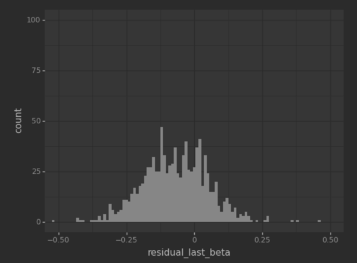
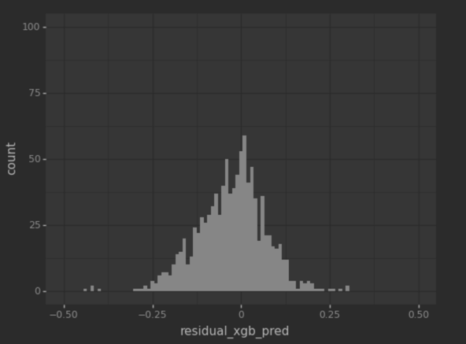
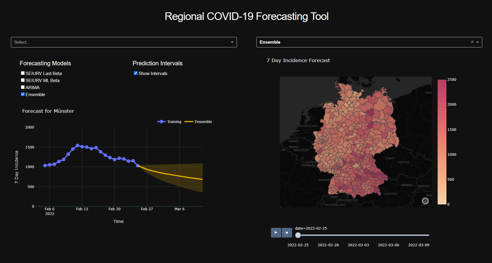

# Regional Forecasting Tool for Covid-19 Using Open Data


### Goal and Motivation:
The goal of this project was to develop a short-term forecasting tool for 
COVID-19 on a regional level using open data to support local health
authorities.
The spread of infectious diseases at the local level can sometimes vary 
greatly, even in districts of the same federal state. 
This heterogeneity can be explained by a wide variety of different 
influencing factors that vary between districts, including different 
vaccination rates, local intervention measures, spread of variants, 
adherence to social distancing and many other factors.
However, forecasting models and tools that are used for policy-making are 
for the most part only available at the federal or state level. 
Infectious disease forecasting is considered one of the most 
difficult forecasting disciplines. We have taken on the challenge of 
developing a forecasting tool at a low aggregation level within a 
semester-long project seminar in the context of
the Information Systems Master program at the WWU Münster.


The images above depicts our final product: A Covid-19 forecasting
dashboard that provides predictions of four different models
for the next 14 days for all 401 German districts.


## Table of Contents
- [Modeling](#modeling)
  - [Differential Equation Models](###Differential-Equation-Models)
    - [SEIURV + Last Beta](#model-1-seiurv---last-beta)
    - [SEIURV + Machine Learning Beta](#model-2-seiurv---ml-beta)
  - [Regression Model](#regression-model)
    - [ARIMA](#model-3-arima-model)
  - [Combined Model](#combined-model)
    - [Ensemble Model](#model-4-ensemble-model)
- [Architecture](#architecture)
- [Configuration](#configuration)
  - [Technical Setup](#technical-setup)
  - [Pipeline Manuals](#pipeline-manuals)
    - [Data Pipeline](#1-data-pipeline)
    - [Matrix Creation Pipeline](#2-matrix-creation-pipeline)
    - [Machine Learning Layer](#3-machine-learning-layer)
    - [Validation Pipeline](#4-validation-pipeline)
    - [Forecasting Pipeline](#5-forecasting-pipeline)
    - [Dashboard](#6-dashboard)
    - [Start here](#7-start-here)

## Modeling
### Differential Equation Models


Our final product consists of four models that are depicted above. Model 1
and 2 are differential equation models. Differential equation models are 
among the most popular subfamilies of mechanistic models for predicting 
infectious disease spreading. The idea behind this modeling family is to 
divide the affected population into different compartments 
based on health status and to model the transitions between the
compartments using differential equations. 

#### Model 1) SEIURV - Last Beta


Our differential equation model consists of 6 different compartments. Two
compartments for susceptible individuals that are susceptible of getting
infected when getting in contact with infectious individuals: 
Vaccinated (**V**) and non-vaccinated (**S**). The exposed compartment 
(**E**) contains individuals that recently got infected but are not 
infectious yet. Infectious individuals that are capable of infecting 
others are again split into two groups for detected (**I**) and 
undetected cases (**U**). Individuals that recently recovered (**R**) 
and currently considered as immune are contained in the last compartment. 
\
Our model is trained by fitting the so-called force of infection parameter β
to the last 14 days. The higher the value of β the more individuals are 
infected by one infectious individual (ceteris paribus) and thus the 
steeper the infection curve. 
The starting values for the different compartments are computed using 
publicly available data provided by the RKI on CoronaDaten Platform. 
The fitting process is depicted below. 


#### Model 2) SEIURV - ML Beta


Our second model is based on the previously introduced SEIURV model. 
Instead of simply using the fitted β for the next period we use add a 
machine learning layer on top of the SEIURV model to predict the optimal
value of β in the next period. This approach allows us to also integrate 
other influencing factors including intervention measures, variants, 
mobility and weather data that could otherwise hardly be integrated into
differential equation models. 

The corresponding machine learning layer consists of six different steps
depicted below. In the first two steps we retrieve open data regarding
the current covid-19 variants, intervention measures, weather
and weekly mobility data on district level compared to 2019 and thus the 
year before the outbreak. In a preprocessing step we take care of missing
data and standardize all predictors. In a consecutive step the most popular
regression models are evaluated and compared to the baseline approach of 
simply using the previous better also for the next period. 
We ended up using an XGBoost model as this yielded the best performance. 


### Regression Model
#### Model 3) ARIMA Model
Besides our differential equation models we also used an ARIMA model that
belongs to the modeling family of regression models. Unlike mechanistic 
models, such as differential equation models, regression models forgo 
explicitly representing transmission dynamics and instead focus on 
detecting patterns in historical data to predict future developments.
The ARIMA model combines an autoregressive (AR) and a moving average (MA) 
approach. The pmdarima package was used to implement our ARIMA model.


### Combined Model
#### Model 4) Ensemble Model
Lastly we also created an ensemble model that allows us to combine the 
predictions of our previously introduced models. For now, our ensemble
model is simply a weighted average of the predictions of our other models.
Our ensemble model could also be expanded to a more sophisticated appraoach
by using a so-called meta learner. This meta learner would be trained to
combine intelligently combine the predictions of the other models by, for
example, considering the strengths and weaknesses of the other models
in certain situations. If, for example, one model performs rather poorly in
certain situations, e.g. the beginning of a new wave, then the meta learner
could learn to adjust the weights in such situations. This offers 
interesting opportunities for future investigation but was out of scope of
our project seminar. 


## Architecture
Below the technical architecture of our implementation is depicted. It
consists of four different layers that will be explained in the following.


###   Data Layer
This layer starts the flow of the application and provides all the data 
required for the models to generate their predictions. It consists of 
four main data sources. CoronaDaten Platform is the core data source of 
the application, which provides all the Covid-19 related data where 
MeteoStat, DESTATIS, and ECDC data is used to train the machine learning 
model of the machine learning layer. 
The data from CoronaDaten Platform and MeteoStat are accessed via API calls.  
DESTATIS and ECDC data is directly accessed as files using http requests. 

###  Storage Layer
By taking the diversity, the growth of the data based on product 
requirements, and the product’s portability into consideration, 
Storage Layer was built on SQLite database engine, which is lightweight, 
can perform conventional SQL queries and provides easy serverless setup. 
Due to the majority of data being transferred and used in Pandas Dataframe 
format within the application, SQLAlchemy is utilized for the 
object-relational mapping between Python and SQLite. The layer is 
responsible for all data storage and distribution within the application.

###  Modeling Layer 
This layer contains all the models used to perform forecasting developed 
based on Python. The model-specific basic implementation libraries are 
used, and adaptations are made according to the project requirements and 
scope. As the core layer of the application, this layer is responsible 
for generating forecasts and related complementary processes.

###  Visualization Layer
The interactive dashboard is comprised in this layer where the user is 
allowed to select, visualize, compare regional forecast results generated 
by our models. Dash by Plotly, built on top of Flask, was considered due 
to its simple yet powerful capabilities for visualisation and user 
interactions compared to other dashboard-capable Python libraries. 
Dash offers a variety of interactive components with better customization 
ability, which allows the product dashboard to be made aesthetically 
pleasing. The Dash application is locally deployed and uses JSON objects 
to communicate with the backend application script, which is also 
automatically handled internally within Dash itself hence also referred 
to as a tightly-integrated backend and front-end.


## Configuration
###  Technical Setup
1) Ensure that you have Python version 3.8 or above installed  and the latest version of _pip_ package-management system. We worked with PyCharm as an IDE and suggest to use it as well especially due to its handy debugging functionalities  .
2) Clone our repository to your desired local folder.
3) Checkout _master_ branch.
5) Install all requirements(in Pycharm you can create a virtual environment and then open the _requirements.txt_ file which will automatically prompt a notification where you can simple click on 'install requirements'). Or you can manually install the requirements by running:
```
pip install -r requirements.txt 
```
6) Now you're all set to run the project. Before executing any script, **make sure you have set the working directory of the environment to the _root_ folder of the project**. To make it easier to inspect and run our code we created a [main.py](main.py) script that allows calling our most important functions and pipelines.
For easier configuration the task variable can be adjusted to choose what function should be executed.
More detailed informations can be found in the comments of the [main.py](main.py) script.
The default option **generate_forecasts** will generate forecasts for the next 14 days 
and automatically start the dashboard locally (http://127.0.0.1:8050/). Here the forecasts
for each district by each model and a complete map view of next 14 days incident development for whole Germany can be inspected.


    **NOTE: You must be connected to the WWU VPN to run the project since some required files stored on the server will be automatically accessed**  

    To configure WWU VPN visit: https://www.uni-muenster.de/IT/services/kommunikation/vpn/ 

7) Optional: If you also want to run our 
[R script](Backend/Evaluation/evaluation_pipeline.R) that was mainly used for producing
plots for our presentation, evaluation purposes as well as computing the historical residuals 
to compute prediction intervals of the differential equation models, 
make sure to install the latest version as well. 
We used version R 4.1.1 for our project. 

###  Pipeline Manuals
In the following we will explain the most important functions and pipelines and how to run them. 

#### 1) Data Pipeline
The pipeline consists of two consecutive steps. 
First, a list of all German districts that currently appear in CoronaDaten Platform is created. 
As different naming conventions for the districts exist on different platforms this list is used throughout 
the entire process as our naming standard. Additionally, information for each district is retrieved namely including
population size as well as geospatial data regarding the main city of the district. 
Consecutively all available RKI-data regarding infection counts, vaccinations, recoveries, etc. are downloaded
from CoronaDaten Platform. This data is accessed using the public API, preprocessed and then stored in the database.  
Then as the second step, non-corona related data that is needed for data matrix creation to train the ML layer will and later as a secondary input to the ML-Compartmental Model is retrieved, preprocessed and stored in their corresponding tables as follows: 
  
- ECDC variant data in ecdc_variant_data table
- DESTATIS mobility data in destatis_mobility_data table
- OXCGRT policy data in oxcgrt_policy_data table  

NOTE about code location(s) & resource files:
  
- Sqlite DB file is created in [Assets/Data](Assets/Data)
  - DB file is created under the name **_covcast.db_** and will be updated to the latest state every time the data pipeline is executed.  
- **Intermediate** data files used during this pipeline run are stored in [Assets/Data/Scraped](Assets/Data/Scraped)  
  - ECDC variant data will be stored under [Assets/Data/Scraped/ecdc](Assets/Data/Scraped/ecdc) and a new DDMMYY.csv file created at each run of the pipeline and same day multiple runs will rewrite the file of that day.
  - DESTATIS mobility data will be stored under [Assets/Data/Scraped/destatis](Assets/Data/Scraped/destatis) and a new DDMMYY.csv file created at each run of the pipeline and same day multiple runs will rewrite the file of that day. **NOTE: another .csv file under the name _destatis_base.csv_ will be maintained here due to the 'past 30 days history only' condition is DESTATIS data source. Therefore, we are maintaining a seperate file (_destatis_base.csv_) in our remote server to allow ourselves to have a continuous history since 2020/01/01.
  - OXCGRT weekly policy index data will be stored under [Assets/Data/Scraped/oxcgrt](Assets/Data/Scraped/oxcgrt) and a new DDMMYY.csv file created at each run of the pipeline and same day multiple runs will rewrite the file of that day.
- Pipeline script is located at [Backend/Data/DataManager/data_pipeline.py](Backend/Data/DataManager/data_pipeline.py) 

#### 2) Matrix Creation Pipeline
The aim of the matrix creation pipeline is to create the dataset
that is used to for training the machine learning model in the machine 
learning layer. For this purpose, the SEIURV model is fitted to the 
infection figures for each calendar week and district over a defined 
period (in this case for the entire period since the start of the 
pandemic in Germany until January 2022). 
For this purpose, the optimal beta is fitted for both the 
training period before the prediction period and 
the validation period. The fitted beta of the training period is also
used for the forecasting period in the case of the **SEIURV + Last Beta** 
model. The latter beta answers the question as to which value of beta
would have yielded the best results for forecasting. This beta therefore
serves as the target variable of the machine learning layer.

To create the matrix we use additional predictors related to other influencing factors along with the fitted beta. These predictor were chosen after conducting several literature studies about indirect/direct influencing factors on Covid-19 spreading. This way we could integrate the impact of influencing factors to our model which is the main idea behind integrating the machine learning layer. The used predictors and their sources are as follows;

- **Mobility data :** 
Obtained from DESTATIS (The Federal Statistical Office Germany) official website where they provide mobiltiy data of the mobile devices connection changes from their service towers during the past 30 days period.  
    _source:_ https://www.destatis.de/DE/Service/EXDAT/Datensaetze/mobilitaetsindikatoren-mobilfunkdaten.html  

- **Policy (Intervention) index data:** 
Obtained from OxCGRT (The Oxford Covid-19 Government Response Tracker) official webisite where they provide an index for the strictness of the goverment interventions covering more than 180 countries.  
    _source:_ https://www.bsg.ox.ac.uk/research/research-projects/covid-19-government-response-tracker  
    
- **Weather data(temperature and wind) :**
Obtained from Meteostat who is one of the largest vendors of open weather and climate data.  
    _source:_ https://www.meteostat.net/en/  

- **Current prominent variant data:** 
Obtained from ECDC (European Centre for Disease Prevention and Control) official webisite where they provide the details of DNA-sequenced covid samples for a given week.  
    _source:_ https://www.ecdc.europa.eu/en  

NOTE about code location(s) & resource files:  

- The resulting matrix is saved as .csv file under the name _all_matrix_data_v3.csv_ and stored in [Assets/Data/](Assets/Data)  
- Pipeline script is located at [Backend/Data/DataManager/data_pipeline.py](Backend/Data/DataManager/matrix_pipeline.py) and script is located at [Backend/Data/DataManager/matrix_data.py](Backend/Data/DataManager/matrix_data.py) will provide more details regarding the pipeline's flow of execution


#### 3) Machine Learning Layer
The machine learning layer is used to create, train, evaluate and export a
machine learning model to predict the best fitting beta for the forecasting
period for the **SEIURV + ML** model. We decided to utilize a Jupyter
Notebook for this purpose mainly due to its ability to output and store
visualizations which makes it easier to follow along for the other team
members. Also for the implementation team this was useful as it was easy 
to step by step  execute specific code snippets only instead of having 
to run an entire script.
This comes with the downside that the 
[notebook](Backend/Modeling/Differential_Equation_Modeling/Machine_Learning_Layer/beta_estimation.ipynb) 
cannot be called from another script unlike a normal python script.  
Before running the notebook the csv file [all_matrix_data_v3.csv](Assets/Data) has to
be created by the matrix creation pipeline or alternatively an existing file has to
be placed under [Assets/Data/](Assets/Data). As describes above, this CSV file
contains the training data for the machine learning layer. After a number of
preprocessing steps that include the removal of outliers and standardizing all
predictors different machine learning regression models are evaluated.
The best performing model is saved as a pickle file for using it for 
producing new forecasts with the SEIURV + ML model. This approach allows 
the model used to be re-trained and extended at any time before it is 
fed into the forecasting pipeline.
Below the residuals (difference between fitted beta and predicted beta) can 
be seen. It can be observed that the errors made by the machine learning
model tend to be smaller than the ones made if one simply uses the fitted
beta from the previous period.

 



#### 4) Validation Pipeline
This pipeline helps to execute a full validation run for all the models used in this project under flexible configuration options. 
This allows to both manually inspect and compare forecasts for a single district for a single forecasting interval, as well as computing
aggregated evaluation measures such as the total RMSE induced by a model for all districts over a certain time period.
Multiple intervals over which the pipeline is supposed to run can be setup. For each interval the model validation pipeline is called. This is usually only done once, unless one wants to run two unconnected time intervals. (Example: Run validation for Apr 2020 - Oct 2020 + Jun 2021 - Jan 2022)

To create an inspect visualizations of forecasts for a single district/forecasting
interval combination the pipeline can be run in debug mode. When the 
validation pipeline is fully run a CSV file containing information 
about the individual forecasts, pipeline configuration metadata as well as 
evaluation metrics is created after the configured pipeline run(s) are completed.
The model_validation_data_metrics_(datetime).csv contains detailed 
information regarding the forecasts of the different models and the 
correct data (validation data). Using the idx column this table is 
connected to the model_validation_data_forecasts_(datetime).csv that 
evaluates the different approaches over each forecasting horizon and 
district combination.  

NOTE about code location(s) & resource files:  

- Evaluation results files generated by this pipeline run are stored in [Assets/Data/Evaluation](Assets/Data/Evaluation).  
- The validation pipeline script is located at [Backend/Data/DataManager/model_validation_pipeline.py](Backend/Data/DataManager/model_validation_pipeline.py).
Here more detailed information is provided regarding the pipeline's flow of execution and its several configuration options.

#### 5) Forecasting Pipeline
The forecasting pipeline is responsible for generating the forecasts displayed in the dashboard.
This is achieved by running all four models and storing the results 
in the SQLite database from where they can be accessed by the dashboard.
Apart from the basic data inputs, this pipeline requires an additional 
file input called prediction_intervals.csv that is created by running
the [R script](Backend/Evaluation/evaluation_pipeline.R). It contains
the historical relative residuals and thus the historical errors made by our
models which are used for creating the prediction intervals of the
differential equation models using a so-called bootstrapping approach. More
detailed information can be found in the corresponding [R script](Backend/Evaluation/evaluation_pipeline.R).

As a default behaviour the latest update of this CSV file will be downloaded 
from our remote server. But if you intend to generate the file your self, 
you can run the above mentioned R script by yourself.

You can run clean the exisiting forecasts and run the pipeline by setting 
the 'with_clean' papameter to 'True' (by default, with_clean=False) and 
also you can start the forecast at any past date of your interest. But the 
latest possible date is today's date and is the default date if not 
specified.  

NOTE about code location(s) & resource files:  

- The prediction pipeline script is located at 
[Backend/Data/DataManager/forecast_pipeline.py](Backend/Data/DataManager/forecast_pipeline.py)  
- Its results are stored in the SQLite database. You can find the methods that handle these tables under _start_forecast_pipeline, end_forecast_pipeline, insert_forecast_vals_ in [Backend/Data/DataManager/db_calls.py](Backend/Data/DataManager/db_calls.py) 

#### 6) Dashboard
The dashboard is designed to be easily accessible, easy-to-use and -comprehend. 
The reason for that is the overall goal to support local health authorities. 
Advanced technical skills cannot be presumed for all employees at local offices. 
Thus, the tool must be usable and understandable without particular technical expertise. 
Furthermore, it should be able to provide and visualise the forecasting results of the different models, forecasting the 7-day-incidence on district level. Below image will give you a brief idea about the overall view of the dashborad.   


  
The dashboard can be subdivided into two parts. The first part aims to show the exact forecasting results for a specific district. First, the district in focus can be selected at the top in a drop-down menu. Below that, additional filters can be chosen. The user can choose the forecasting result of which model they want to visualise on the left. All four models (SEIURV Last Beta, SEIURV ML Beta, ARIMA, and Ensemble) are available. It is possible only to view the results of individual models or multiple results simultaneously. That allows easy direct comparison of the different results. Another filter option that can be selected is to show the prediction intervals. The intervals indicate the probability that the actual results lie within the area and show the possible deviations. Central in the visualisation is the graph that visualises the forecasting results over two weeks. The x-axis represents the training and forecasting time horizon, while the y-axis depicts the 7-day-incidence. The forecasting lines of the different models are coloured differently, making it easier to distinguish them. To make it easier to compare different districts, the same colour is always associated with the same model. When hovering with the mouse over a forecasting line, detailed information is displayed automatically: the model used, date, and 7-day-incidence.  

NOTE about code location(s) & starting manually:
  
- The dashboard app is design to run automatically after the forecast pipeline (if not opened automatically in a new tab of your default browser, please have a look at the console for _''--> App Server is started successfully!''_. If found click on it manually to open. If not and no error is found in the console, then please wait until the server is started and ready).
- If you have already executed a forecast run (read the 'Pipeline Manual 7' below) and just need to start the dashboard, please go to [Frontend/AnalyticsTool/forecast_dashboard.py](Frontend/AnalyticsTool/forecast_dashboard.py) and execute the script manually. 
  
#### 7) Start here
For your conviniece, All above explained complex pipelines are compacted into two execution tasks so that you can experience the Tool in a fast and easy manner. these task are set up in the [main.py](main.py)  

Assigning different tasks name to the task variable in the main.py script will allow you to run different process of our tool:
    
- **task --> 'generate_forecasts':**
        
This will only collect basic data from the scratch, Apart from the basic data inputs, this pipeline requires an additional file input called prediction_intervals.csv. These intervals are used for computing the prediction intervals for differential equation models for forecasting. 'generate_forecasts' will automatically download the latest existing _**prediction_intervals.csv**_ from our remote server during the pipeline run. After forecasts generated, 
  the dashboard app will automatically start in your web browser (this may take about approx.20-30sec)  

**NOTE: to generate this prediction_intervals.csv by yourself with different configurations, you need to execute the evaluation_pipeline.R script manually [Frontend/AnalyticsTool/forecast_dashboard.py](Backend/Evaluation/evaluation_pipeline.R). Where you can find further explanations to configure and execute the script.**
        
- **task --> 'run_model_validation':**
        
This pipeline helps to execute a full validation run for all the models used in this project under flexible different configurations. For instance, multiple intervals over which the pipeline is supposed to run can be setup. For each interval the model validation pipeline will be called (includes all the models). This is usually only done once, unless one wants to run two unconnected time intervals.  
(Example: Run validation for Apr 2020 - Oct 2020 + Jun 2021 - Jan 2022) 

After the configured pipeline run(s) are completed, it provides an output which contain all the forecast results along with corresponding evaluation results which will be later. The model_validation_data_metrics_(datetime).csv contains detailed information regarding the forecasts of the different models and the correct data (validation data). Using the idx column this table is connected to the **__model_validation_data_forecasts_(datetime).csv_** that evaluates the different approaches over each forecasting horizon and district combination.
