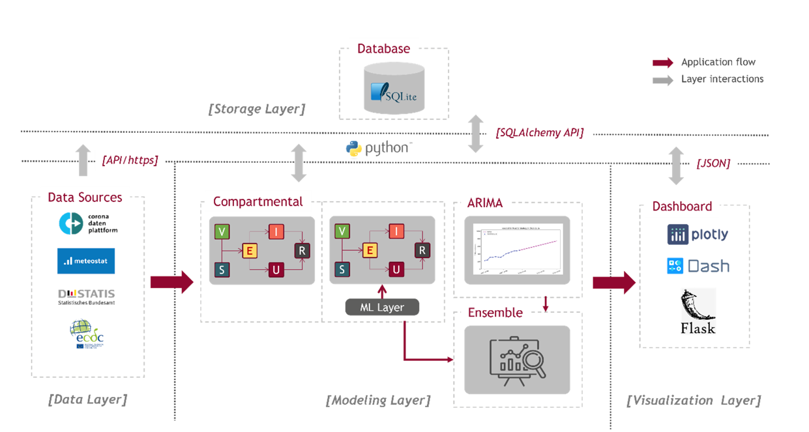

# Regional Forecasting Tool for Covid-19 Using Open Data


### Goal and Motivation:
The goal of this project was to develop a short-term forecasting tool for 
COVID-19 on a regional level using open data that could support local health
authorities in Germany.
The motivation of our project is the fact that local infection incidence 
can sometimes be very different from other districts, even for districts 
in the same state. This heterogeneity can be explained by the many different 
influencing factors that vary between districts, including different 
vaccination rates, local intervention measures, spread of variants, 
adherence to social distancing and many other factors.
However, forecasting models and tools that are used for policy-making are 
for the most part only available at the federal or state level. 
Infectious disease forecasting is considered one of the most 
difficult forecasting disciplines.  
We have taken on the challenge of developing a forecasting tool at a low 
aggregation level within a semester-long project seminar in the context of
the Information Systems Master program at the WWU Münster.


The images above depict our final end product, our Covid-19 forecasting
dashboard that provides predictions for the next 14 days for all 400
German districts.


## Table of Contents
- [Modeling](#modeling)
  - [Differential Equation Models](###Differential-Equation-Models)
    - [SEIURV + Last Beta](#Model-1\)-SEIURV-Last-Beta)
    - [SEIURV + Machine Learning Beta](#Model-2\)-SEIURV-ML-Beta)
  - [Regression Model](#Regression-Model)
    - [ARIMA](#Model-3\)-Arima-Model)
  - [Combined Model](#Combined-Model)
    - [Ensemble Model](#Model-4\)-Ensemble-Model)
- [Architecture](#architecture)
- [How to use](#how-to-use)
  - [Technical Setup](#Technical-Setup)
  - [Configuration](#configuration)

## Modeling
### Differential Equation Models


Our final product consists of four models that are depicted above. Model 1
and 2 are differential equation models. Differential equation models are 
among the most popular subfamilies of mechanistic models for predicting 
infectious disease spreading. The idea behind this modeling family is to 
divide the affected population into different compartments 
based on health status and to model the transitions between the
compartments using differential equations. 

#### Model 1) SEIURV - Last Beta


Our differential equation model consists of 6 different compartments. Two
compartments for susceptible individuals that are susceptible of getting
infected when getting in contact with infectious individuals: 
Vaccinated (**V**) and non-vaccinated (**S**). The exposed compartment 
(**E**) contains individuals that recently got infected but are not 
infectious yet. Infectious individuals that are capable of infecting 
others are again split into two groups for detected (**I**) and 
undetected cases (**U**). Individuals that recently recovered (**R**) 
and currently considered as immune are contained in the last compartment. 
\
Our model is trained by fitting the so-called force of infection parameter β
to the last 14 days. The higher the value of β the more individuals are 
infected by one infectious individual (ceteris paribus) and thus the 
steeper the infection curve. 
The starting values for the different compartments are computed using 
publicly available data provided by the RKI on CoronaDaten Platform. 
The fitting process is depicted below. 


#### Model 2) SEIURV - ML Beta


Our second model is based on the previously introduced SEIURV model. 
Instead of simply using the fitted β for the next period we use add a 
machine learning layer on top of the SEIURV model to predict the optimal
value of β in the next period. This approach allows us to also integrate 
other influencing factors including intervention measures, variants, 
mobility and weather data that could otherwise hardly be integrated into
differential equation models. 

The corresponding machine learning layer consists of six different steps
depicted below. In the first two steps we retrieve open data regarding
the current covid-19 variants, intervention measures, weather
and weekly mobility data on district level compared to 2019 and thus the 
year before the outbreak. In a preprocessing step we take care of missing
data and standardize all predictors. In a consecutive step the most popular
regression models are evaluated and compared to the baseline approach of 
simply using the previous better also for the next period. 
We ended up using an XGBoost model as this yielded the best performance. 


### Regression Model
#### Model 3) ARIMA Model
Besides our differential equation models we also used an ARIMA model that
belongs to the modeling family of regression models. Unlike mechanistic 
models, such as differential equation models, regression models forgo 
explicitly representing transmission dynamics and instead focus on 
detecting patterns in historical data to predict future developments.
The ARIMA model combines an autoregressive (AR) and a moving average (MA) 
approach. The pmdarima package was used to implement our ARIMA model.


### Combined Model
#### Model 4) Ensemble Model
Lastly we also created an ensemble model that allows us to combine the 
predictions of our previously introduced models. For now, our ensemble
model is simply a weighted average of the predictions of our other models.
Our ensemble model could also be expanded to a more sophisticated appraoach
by using a so-called meta learner. This meta learner would be trained to
combine intelligently combine the predictions of the other models by, for
example, considering the strengths and weaknesses of the other models
in certain situations. If, for example, one model performs rather poorly in
certain situations, e.g. the beginning of a new wave, then the meta learner
could learn to adjust the weights in such situations. This offers 
interesting opportunities for future investigation but was out of scope of
our project seminar. 


## Architecture
Below the technical architecture of our implementation is depicted. It
consists of four different layers that will be explained in the following.



###   Data Layer
This layer starts the flow of the application and provides all the data 
required for the models to generate their predictions. It consists of 
four main data sources. CoronaDaten Platform is the core data source of 
the application, which provides all the Covid-19 related data where 
MeteoStat, DESTATIS, and ECDC data is used to train the machine learning 
model of the machine learning layer. 
The data from CoronaDaten Platform and MeteoStat are accessed via API calls.  DESTATIS and ECDC data is directly accessed as files using http requests. 

###  Storage Layer
By taking the diversity, the growth of the data based on product 
requirements, and the product’s portability into consideration, 
Storage Layer was built on SQLite database engine, which is lightweight, 
can perform conventional SQL queries and provides easy serverless setup. 
Due to the majority of data being transferred and used in Pandas Dataframe 
format within the application, SQLAlchemy is utilized for the 
object-relational mapping between Python and SQLite. The layer is 
responsible for all data storage and distribution within the application.

###  Modeling Layer 
This layer contains all the models used to perform forecasting developed 
based on Python. The model-specific basic implementation libraries are 
used, and adaptations are made according to the project requirements and 
scope. As the core layer of the application, this layer is responsible 
for generating forecasts and related complementary processes.

###  Visualization Layer
The interactive dashboard is comprised in this layer where the user is 
allowed to select, visualize, compare regional forecast results generated 
by our models. Dash by Plotly, built on top of Flask, was considered due 
to its simple yet powerful capabilities for visualisation and user 
interactions compared to other dashboard-capable python libraries. 
Dash offers a variety of interactive components with better customization 
ability, which allows the product dashboard to be made aesthetically 
pleasing. The Dash application is locally deployed and uses JSON objects 
to communicate with the backend application script, which is also 
automatically handled internally within Dash itself hence also referred 
to as a tightly-integrated backend and front-end.


## How to use
###  Technical Setup
1) Ensure that you have Python version 3.9 installed . We worked with PyCharm as an IDE and suggest to use it as well especially due to its handy debugging functionalities  .
2) Clone our repository to your desired local folder.
3) Install all requirements. To do so This can be done by running: 
```
pip install -r requirements.txt 
```
4) Optional: If you also want to run our R script that was mainly used for producing
plots for our presentation as well as evaluation purposes make sure to install the latest version as well. 
We used version R 4.1.1 for our project.

###  Configuration
In the following we will explain the most important functions and pipelines and how to run them. 

#### 1) Data Pipeline

#### 2) Matrix Creation Pipeline

#### 3) Machine Learning Layer

#### 4) Evaluation Pipeline

#### 5) Forecasting Pipeline

#### 6) Dashboard
