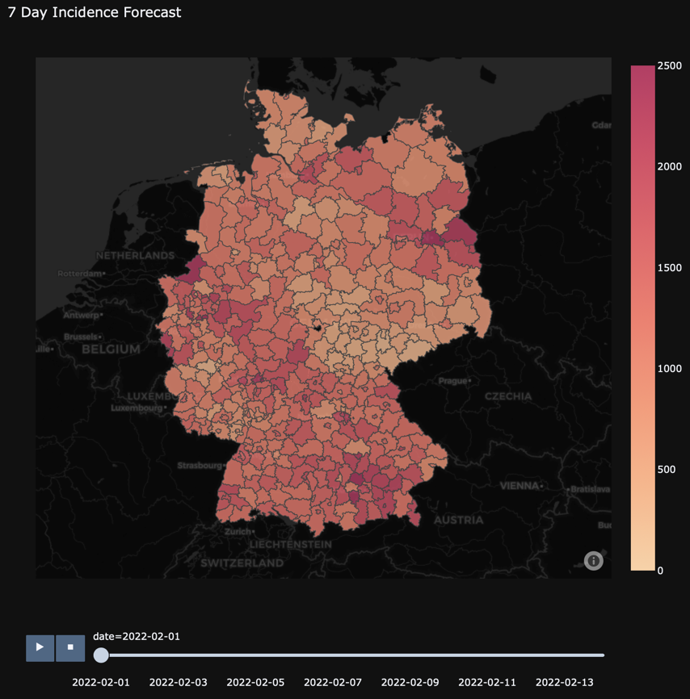

# Regional Forecasting Tool for Covid-19 

### Goal and Motivation:
The goal of this project was to develop a short-term forecasting tool for 
COVID-19 on a regional level using open data that could support local health
authorities in Germany.
The motivation of our project is the fact that local infection incidence 
can sometimes be very different from other districts, even for districts 
in the same state. This heterogeneity can be explained by the many different 
influencing factors that vary between districts, including different 
vaccination rates, local intervention measures, spread of variants, 
adherence to social distancing and many other factors.
However, forecasting models and tools that are used for policy-making are 
for the most part only available at the federal or state level. 
Infectious disease forecasting is considered one of the most 
difficult forecasting disciplines.  
We have taken on the challenge of developing a forecasting tool at a low 
aggregation level within a semester-long project seminar in the context of
the Information Systems Master program at the WWU Münster.

The images above depict our final end product, our forecasting tool that 
provides forecasts for the next 14 days.

## Table of Contents
- [Modeling](#modeling)
- [Architecture](#architecture)
- [Dashboard](#dashboard)
- [How to use](#how-to-use)
  - [Technical Setup](#Technical-Setup)
  - [Configuration](#configuration)

## Modeling
### Differential Equation Models

Our final product consists of four models that are depicted above. Model 1
and 2 are differential equation models. Differential equation models are 
among the most popular subfamilies of mechanistic models for predicting 
infectious disease spreading. The idea behind this modeling family is to 
divide the affected population into different compartments 
based on health status and to model the transitions between the
compartments using differential equations. 

#### Model 1) SEIURV - Last Beta

Our differential equation model consists of 6 different compartments. Two
compartments for susceptible individuals that are susceptible of getting
infected when getting in contact with infectious individuals: 
Vaccinated (**V**) and non-vaccinated (**S**). The exposed compartment 
(**E**) contains individuals that recently got infected but are not 
infectious yet. Infectious individuals that are capable of infecting 
others are again split into two groups for detected (**I**) and 
undetected cases (**U**). Individuals that recently recovered (**R**) 
and currently considered as immune are contained in the last compartment. 
\
Our model is trained by fitting the so-called force of infection parameter β
to the last 14 days. The higher the value of β the more individuals are 
infected by one infectious individual (ceteris paribus) and thus the 
steeper the infection curve. 
The starting values for the different compartments are computed using 
publicly available data provided by the RKI on CoronaDaten Platform. 
The fitting process is depicted below. 

#### Model 2) SEIURV - ML Beta

Our second model is based on the previously introduced SEIURV model. 
Instead of simply using the fitted β for the next period we use add a 
machine learning layer on top of the SEIURV model to predict the optimal
value of β in the next period. This approach allows us to also integrate 
other influencing factors including intervention measures, variants, 
mobility and weather data that could otherwise hardly be integrated into
differential equation models. 

The corresponding machine learning layer consists of six different steps
depicted below. In the first two steps we retrieve open data regarding
the current covid-19 variants, intervention measures, weather
and weekly mobility data on district level compared to 2019 and thus the 
year before the outbreak. In a preprocessing step we take care of missing
data and standardize all predictors. In a consecutive step the most popular
regression models are evaluated and compared to the baseline approach of 
simply using the previous better also for the next period. 
We ended up using an XGBoost model as this yielded the best performance. 

### Regression Models
#### Model 3) ARIMA Model
Besides our differential equation models we also used an ARIMA model that
belongs to the modeling family of regression models. Unlike mechanistic 
models, such as differential equation models, regression models forgo 
explicitly representing transmission dynamics and instead focus on 
detecting patterns in historical data to predict future developments.
The ARIMA model combines an autoregressive (AR) and a moving average (MA) 
approach. The pmdarima package was used to implement our ARIMA model.

### Ensemble Model
Lastly we also created an ensemble model that allows us to combine the 
predictions of our previously introduced models. For now, our ensemble
model is simply a weighted average of the predictions of our other models.
Our ensemble model could also be expanded to a more sophisticated appraoach
by using a so-called meta learner. This meta learner would be trained to
combine intelligently combine the predictions of the other models by, for
example, considering the strengths and weaknesses of the other models
in certain situations. If, for example, one model perform rather poorly in
certain situations, e.g. the beginning of a new wave, then the meta learner
could learn to adjust the weights in such situations. This offers 
interesting opportunities for future investigation but was out of scope of
our project seminar. 

## Architecture

## Dashboard

## How to use
### Technical Setup
### Configuration