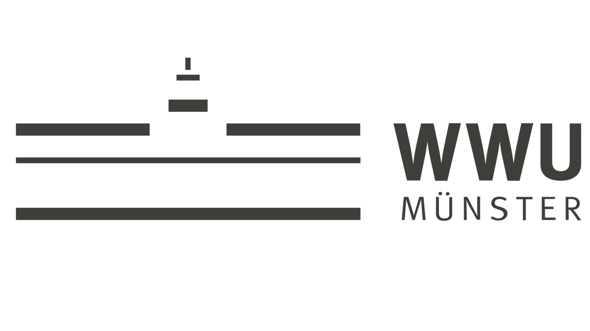

# Regional Forecasting Tool for Covid-19 

### Goal and Motivation:
The goal of this project was to develop a short-term forecasting tool for 
COVID-19 on a regional level using open data that could support local health
authorities in Germany.
The motivation of our project is the fact that local infection incidence 
can sometimes be very different from other districts, even for districts 
in the same state. This heterogeneity can be explained by the many different 
influencing factors that vary between districts, including different 
vaccination rates, local intervention measures, spread of variants, 
adherence to social distancing and many other factors.
However, forecasting models and tools that are used for policy-making are 
for the most part only available at the federal or state level. 
Infectious disease forecasting is considered one of the most 
difficult forecasting disciplines.  
We have taken on the challenge of developing a forecasting tool at a low 
aggregation level within a semester-long project seminar in the context of
the Information Systems Master program at the WWU Münster.

The images above depict our final end product, our forecasting tool.

## Table of Contents
- [Modeling](#modeling)
- [Architecture](#architecture)
- [Dashboard](#dashboard)
- [How to use](#how-to-use)
  - [Technical Setup](#Technical-Setup)
  - [Configuration](#configuration)

## Modeling
### Differential Equation Models

Our final product consists of four models that are depicted above. Model 1
and 2 are differential equation models. Differential equation models are 
among the most popular subfamilies of mechanistic models for predicting 
infectious disease spreading. The idea behind this modeling family is to 
divide the affected population into different compartments 
based on health status and to model the transitions between the
compartments using differential equations. 

#### Model 1) SEIURV - Last Beta

Our differential equation model consists of 6 different compartments. Two
compartments for susceptible individuals that are susceptible of getting
infected when getting in contact with infectious individuals: 
Vaccinated (**V**) and non-vaccinated (**S**). The exposed compartment 
(**E**) contains individuals that recently got infected but are not 
infectious yet. Infectious individuals that are capable of infecting 
others are again split into two groups for detected (**I**) and 
undetected cases (**U**). Individuals that recently recovered (**R**) 
and currently considered as immune are contained in the last compartment. 

## Architecture

## Dashboard

## How to use
### Technical Setup
### Configuration